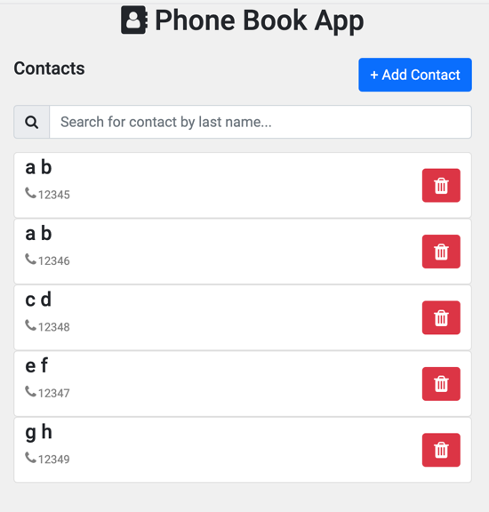
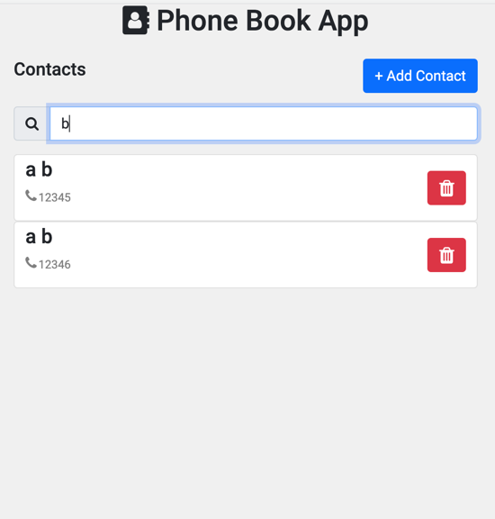
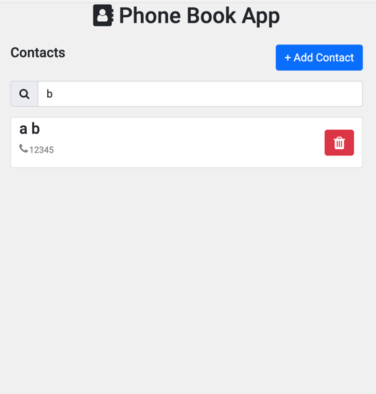
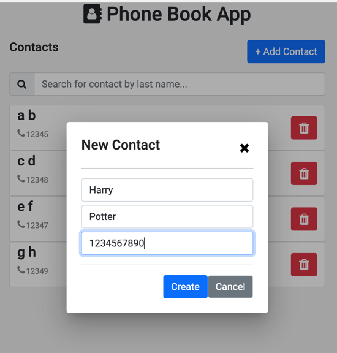
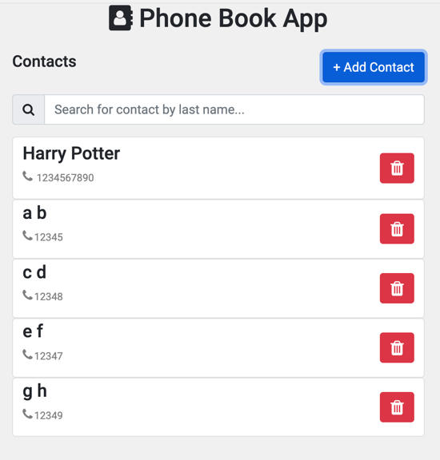

# PhoneBookUi
This project was generated with [Angular CLI](https://github.com/angular/angular-cli) version 8.3.21.

## Description
- This app will help user to maintain records of contacts as contact’s name and phone number.
- The app provides following functionalities -
  - Add new contacts and update and remove existing contacts.
  - Sort the phone book in ascending/descending order by name/number.
- The app does not use any database for showing the data. All data is stored within the browser.

## Development server
- Install node and angular CLI on your machine
- Clone this project to your machine
- Run `npm install` (one time) to get all the dependencies mentioned in package.json
- Run `ng serve` for a dev server. Navigate to `http://localhost:4200/`. The app will automatically reload if you change any of the source files.

## References
- [Adding model as a component](https://blog.angular-university.io/angular-material-dialog/)

## UI Snapshots

### Contact list sorted on first name and phone number

### Searching contact by last name

### Deleting contact

### Adding a contact

 

